# instagram_clone

---ScreenShots & Videos---

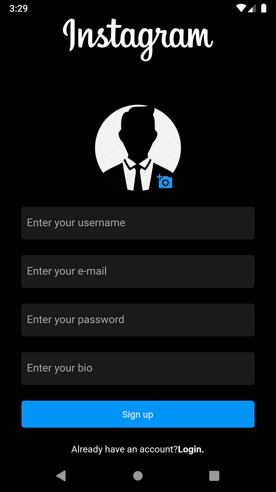  |  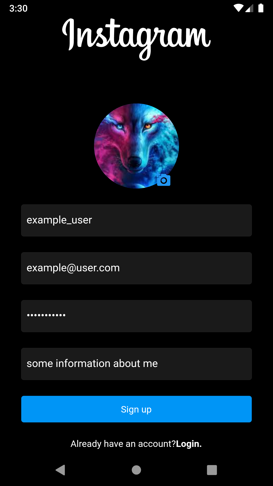  |
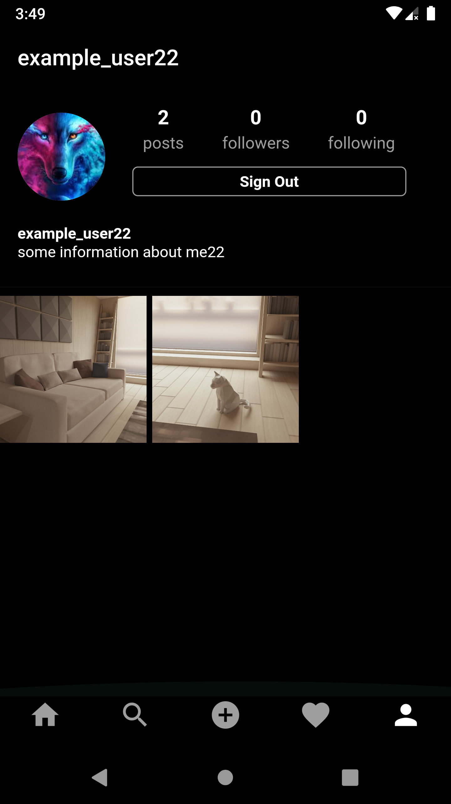  |  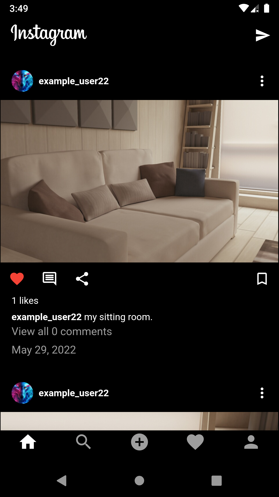  |
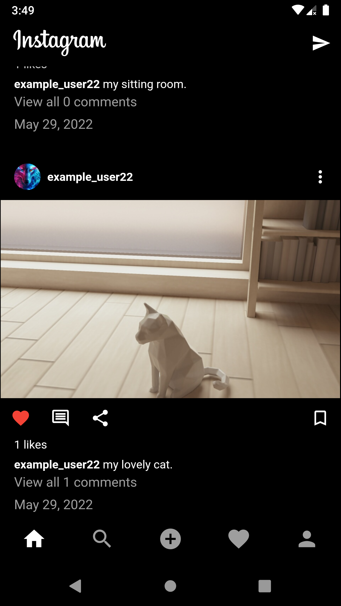  |  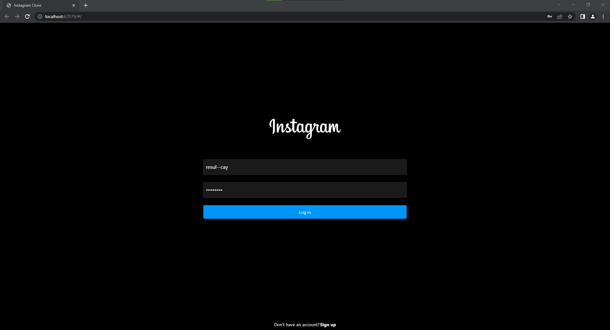  |
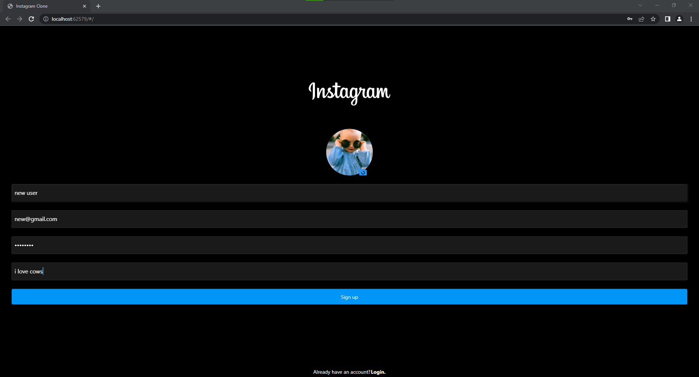  |  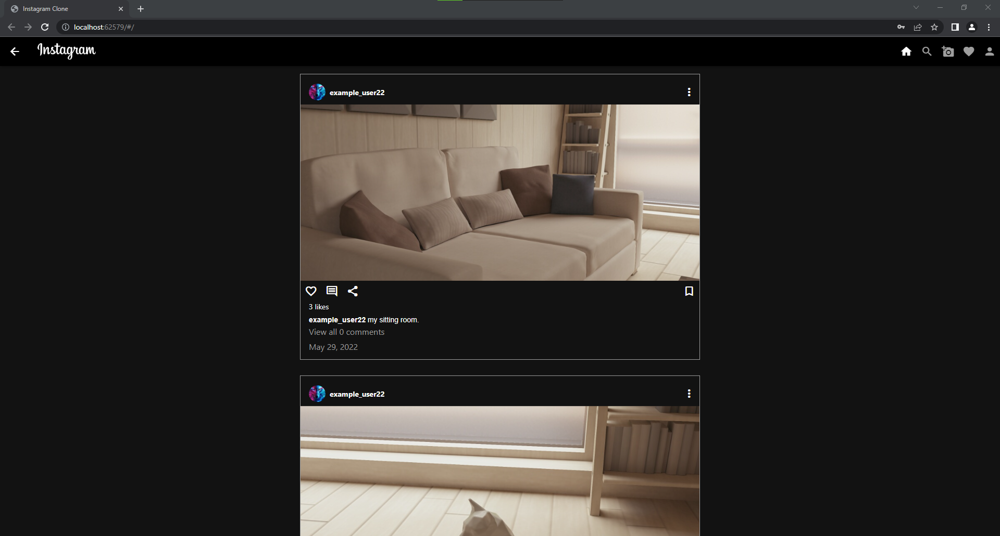  |
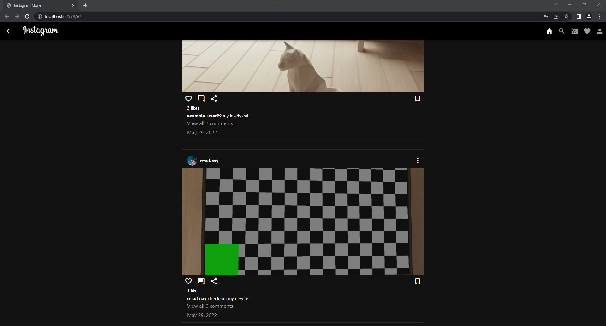  |  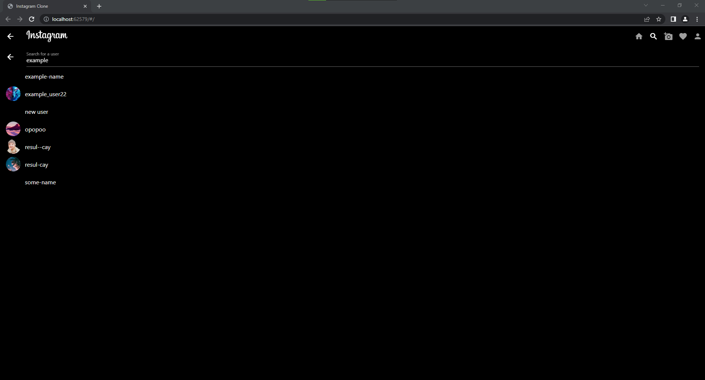  |
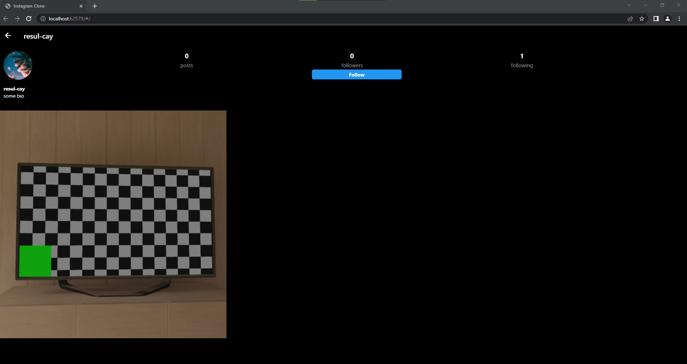  |  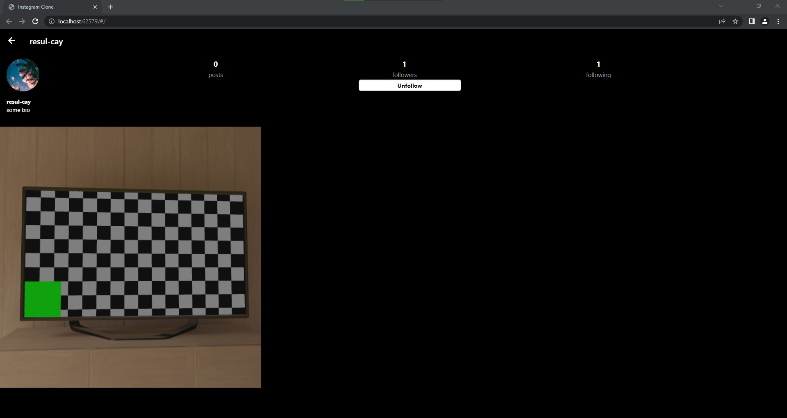  |

https://user-images.githubusercontent.com/102043234/170881736-2de9524e-d78f-441b-bd37-65bb751b3e1c.mp4

https://user-images.githubusercontent.com/102043234/170881764-101ea272-92d0-4df1-b994-5161468df27f.mp4

https://user-images.githubusercontent.com/102043234/170881775-61af8160-d3e5-4226-8d8a-fda378840db2.mp4

Inspired on: [https://www.youtube.com/watch?v=LN668OAUrK4](https://www.youtube.com/watch?v=BBccK1zTgxw)

## Getting Started

This project is a starting point for a Flutter application.

A few resources to get you started if this is your first Flutter project:

- [Lab: Write your first Flutter app](https://flutter.dev/docs/get-started/codelab)
- [Cookbook: Useful Flutter samples](https://flutter.dev/docs/cookbook)

For help getting started with Flutter, view our
[online documentation](https://flutter.dev/docs), which offers tutorials,
samples, guidance on mobile development, and a full API reference.
